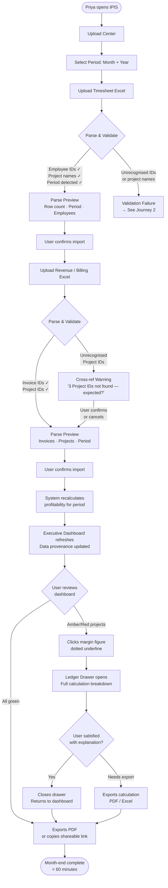
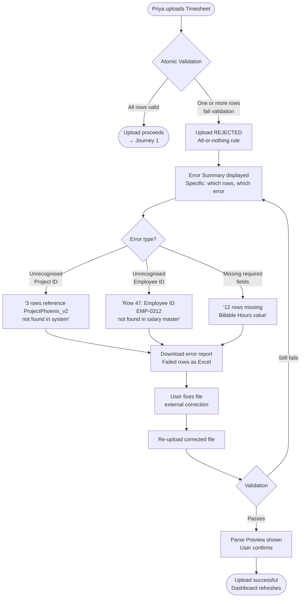
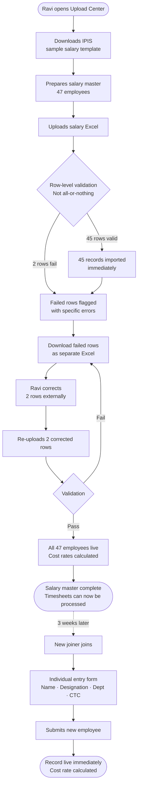
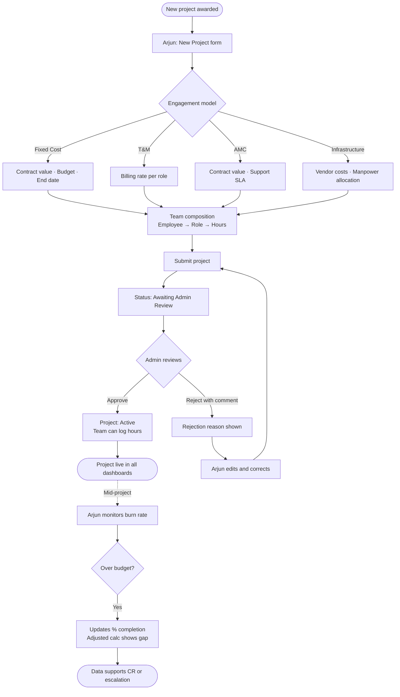
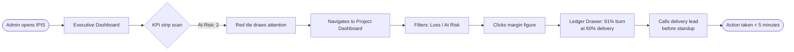

# UX Design Specification BMAD_101

**Author:** Dell
**Date:** 2026-02-23

---

## Section 1 — Project Understanding

### 1.1 Project Vision

**IPIS (Internal Profitability Intelligence System)** is an internal web application that replaces Excel-based profitability tracking for an IT services company. The system ingests three data sources — annual employee salaries, monthly timesheets, and monthly revenue/billing records — and surfaces profitability intelligence across four dimensions: employee, project, department, and client.

**UX Mission:** Make financial truth feel trustworthy. Every screen must communicate that the numbers are correct, traceable, and role-appropriate. Trust is the primary UX outcome.

**Design Scale:** ~26 design surfaces (20 routes + ~6 modal/drawer overlays) across a tiered effort model:
- **Tier 1 — High effort (7 screens):** Priya's core workflow — Executive Dashboard, Employee Dashboard, Project Dashboard, Department Dashboard, Upload Center, Calculation Detail Drawer, and Reports
- **Tier 2 — Medium effort (4 screens):** Project lifecycle views — Project List, Project Detail, Employee Detail, Department Detail
- **Tier 3 — Low effort (~10 screens):** Admin, HR, auth, and configuration screens (role management, user management, system config, login/auth flow)

---

### 1.2 Target Users

| Persona | Role | Primary Goal | Design Priority |
|---|---|---|---|
| **Priya** — Finance Controller | Finance | Complete P&L view, margin analysis, upload management | **Primary** — design for Priya first |
| **Ravi** — Delivery Manager | Delivery Manager | Project-level margin, burn rate, utilization | Secondary |
| **Arjun** — Department Head | Department Head | Department revenue, cost, utilization comparison | Secondary |
| Admin | Admin | System configuration, user/role management | Tertiary |
| HR | HR | Salary data management, utilization reports | Tertiary |

**Design Hierarchy:** Priya's workflow is the spine of the application. When any screen serves multiple roles, Priya's information needs take priority in visual hierarchy and layout decisions.

---

### 1.3 Visual Design Direction

**Color System**
- **Primary:** Deep navy blue (from company website — professional, authoritative, financial)
- **Accent:** Red/coral (used sparingly for alerts, negative margins, critical indicators)
- **Backgrounds:** White and light gray surfaces, card-based layout
- **Financial data:** High-contrast text on white for maximum readability

**Component Library:** Ant Design (antd)
- Leverage antd's Table, Statistic, Card, Drawer, Upload, Select, DatePicker components
- Use antd's built-in financial/data-dense table patterns as the primary data display pattern
- Customize antd theme tokens to match navy/red brand palette

**Data Presentation Style:** P&L-style financial tables
- Dense, multi-column tables with fixed headers
- Numeric alignment right-justified
- Color coding: green for positive margins, red/coral for negative or warning thresholds
- Percentage columns alongside absolute values

---

### 1.4 Key Design Challenges

1. **Role-scoped navigation without context loss** — Each of the 5 roles sees a different subset of the application. Navigation must feel complete and purposeful within each role's scope, not like a reduced version of a larger system.

2. **Upload feedback as confidence, not delight** — Upload occurs weekly. The UX must communicate data integrity (row counts, validation errors, period coverage) so Priya trusts the import before dashboard numbers refresh. This is not a "drag and drop" delight moment — it is a financial ledger entry.

3. **Dashboard density vs. readability** — Finance users expect dense, information-rich screens. The challenge is achieving P&L-table density while maintaining visual hierarchy so the most important signals (margin health, utilization alerts) are immediately scannable.

4. **Calculation explainability — the Ledger Pattern** — When a user questions a profitability number (e.g., "why is this project -12%?"), they must be able to trace the calculation. This is implemented as a **Table-in-Drawer** pattern: clicking any margin figure opens a structured breakdown drawer showing: hours × cost rate → labor cost, invoice amount → revenue, revenue − cost → margin. This pattern requires a dedicated calculation-detail API endpoint (flagged for architecture alignment).

5. **Project lifecycle states across 4 engagement models** — T&M, Fixed Cost, AMC, and Infrastructure projects have different revenue and cost logic. UI must communicate which model applies and adapt displayed fields accordingly (e.g., "Budget vs. Actual" only for Fixed projects; "Support Hours" emphasis for AMC).

---

### 1.5 Design Opportunities

1. **Upload-as-confidence-confirmation** — Design the upload flow as a structured confirmation ceremony: upload → parse preview → validation summary → confirm import. Each stage shows the data state clearly. This reduces re-upload errors and builds Priya's trust in the monthly data cycle.

2. **Portfolio health visualization** — Beyond standard bar/line charts, explore portfolio-level views: a project scatter plot (margin % vs. revenue size), a utilization heat map by department/month, or a profitability waterfall chart. These give leadership fast visual answers that tables cannot.

3. **Ant Design financial component suite** — antd's Table with fixed columns, Summary rows, and nested expandable rows is well-suited to financial reporting. Leverage these built-in patterns rather than custom-building, keeping implementation velocity high and the UI familiar to users accustomed to enterprise tools.

---

## Section 2 — Core User Experience

### 2.1 Defining Experience

The heart of IPIS is the **monthly profitability review cycle**. Priya (Finance Controller) completes this cycle every month: upload three Excel files → validate the data is clean → review dashboards → investigate anomalies → act on findings.

The single most important interaction is **margin investigation** — when a profitability number looks wrong, the user must be able to trace it to its source in one click. Everything else in the application supports this core loop.

The most frequently used interaction is **dashboard review with date-range filtering**. The make-or-break interaction is **calculation traceability via the Ledger Drawer**.

---

### 2.2 Platform Strategy

| Dimension | Decision | Rationale |
|---|---|---|
| **Platform** | Web application (React SPA) | Internal tool, browser-accessible across the organization |
| **Primary device** | Desktop | Financial analysis is desk work; data tables require screen real estate |
| **Input modality** | Mouse + keyboard primary | Dense data tables, filter controls, date pickers |
| **Connectivity** | Always-connected (no offline) | Internal AWS-hosted, always on corporate network |
| **Mobile** | Responsive for basic access | Leadership may need read-only access on tablets; full analysis remains desktop |

---

### 2.3 Effortless Interactions

These interactions must require zero cognitive effort — they should feel like a direct extension of the user's intent:

1. **Date range switching** — Changing from "This Month" to "YTD" to "Last Quarter" instantly reflows all dashboard figures. No page reload, no spinner longer than 300ms, no loss of scroll position.

2. **Number → explanation in one click** — Any **derived** figure on any dashboard opens the Ledger Drawer with the full calculation breakdown. Raw uploaded values (invoice amounts, hours logged) are display-only and do not link to a drawer. Visual convention: derived figures carry a dotted underline — a signal familiar to finance users from Excel meaning "this has a formula."

   **Derived fields subject to Ledger Drawer traceability:**
   - Margin % (all dashboard types)
   - Employee Cost (per project allocation)
   - Utilization %
   - Billable %
   - Cost per Hour
   - Revenue Contribution (Employee dashboard)

   These six fields form the API's calculation-detail contract and must return decomposed payloads, not just final values.

   **Ledger Drawer requirements:**
   - Shows which employees/cost lines are included in the calculation so scope differences between roles are visible
   - Includes an **Export Calculation** action — produces a structured PDF or Excel export of the full breakdown for the selected period and entity (audit compliance use case)

3. **Upload flow — first-time vs. replacement** — Two distinct upload states:
   - *First upload:* Guided sequence with clear data dependency messaging. If timesheets are uploaded before the salary file exists for that fiscal year, the system warns: *"No salary data found for FY[year]. Timesheet cost calculations will be incomplete until salary data is uploaded."* — informational, not a hard block.
   - *Replacement upload:* Explicit confirmation — *"This replaces [Month, Year] data previously uploaded on [date]."* Priya must never wonder whether old and new data are mixed. Replacement triggers a notification to all users who have accessed that period's data.

4. **Upload cross-reference validation** — Beyond file-format checking, the system cross-references uploaded values against known records. Unrecognised Project IDs in a revenue file are flagged as warnings at the confirmation step: *"3 project IDs in this file are not found in existing records — is this expected?"* This catches silent misattribution errors before they reach dashboards.

5. **Upload history log** — Every dashboard surface displays the data provenance for the current view: *"Revenue data: Uploaded by [user] on [date]."* A full upload history log (who uploaded what, for which period, when) is accessible from the Upload Center. Priya must always know whose data she's looking at.

6. **Role-scoped navigation** — Each role's navigation feels complete within its scope, not like a restricted version of a larger system. A Delivery Manager sees exactly what they need; nothing feels hidden or locked.

---

### 2.4 Critical Success Moments

| Moment | What Happens | Emotional Outcome |
|---|---|---|
| **First salary upload** | Admin/Finance uploads the annual salary file; system confirms employee count, period, and cost-per-hour readiness | Confidence — "the foundation is set" |
| **First clean month-end** | All 3 files upload, validation passes, dashboard numbers match Priya's mental model | Relief + trust — "I can rely on this" |
| **First investigation** | Ravi clicks a red-margin project, traces it to under-billed employees via the Ledger Drawer in two clicks | Power + clarity — "I finally understand why" |
| **Leadership review** | Arjun opens Department dashboard, shares screen — the numbers tell the story without narration | Confidence — "This speaks for itself" |
| **Annual planning** | Priya filters full year, exports a report, uses it directly for next year's pricing proposals | Completeness — "This replaced three spreadsheets" |
| **Audit response** | Priya exports a full calculation breakdown from the Ledger Drawer as a PDF for an external auditor | Trust — "The system defended us" |

The moment that determines whether IPIS succeeds or fails: **Priya's first month-end close using the system.** If it takes less time and produces more confidence than Excel, adoption is secured.

---

### 2.5 Experience Principles

These four principles govern all UX decisions in IPIS:

1. **Trust before delight.** Every screen must communicate that the numbers are correct, traceable, and role-appropriate. Visual polish is secondary to numerical credibility.

2. **One click to truth.** Any derived figure that could be questioned must be explainable without navigation. The Ledger Drawer is not a feature — it is a design requirement. It must also surface *what is included* in the calculation, so role-scoped margin differences are self-explaining rather than contradictory.

3. **Ceremony where it matters, speed everywhere else.** The upload flow deserves careful, confirmatory steps — especially cross-reference validation and data provenance labeling. Dashboard navigation deserves instant response. Know which is which.

4. **Designed for Priya, accessible to all.** When information hierarchy decisions arise, optimize for the Finance Controller's workflow first. Other roles benefit from the same clarity.

---

## Section 3 — Desired Emotional Response

### 3.1 Primary Emotional Goals

IPIS serves an internal finance audience where **credibility, not delight, is the primary emotional currency**. Users are not here to be surprised — they are here to feel certain.

**Primary Emotional Goal: Confidence**
> *"I trust these numbers and I can defend them to anyone."*

Every screen, every interaction, every validation message exists to build toward this single feeling. Priya sharing a dashboard with the CEO should feel like standing on solid ground — not hoping the data is right.

**Supporting Emotional Goals:**

| Emotion | Expression | Who Feels It |
|---|---|---|
| **In control** | "I understand what's happening in the business" | Priya, Ravi, Arjun |
| **Relief** | "The month-end close is done and I know it's correct" | Priya |
| **Capable** | "This tool makes me better at my job" | All roles |
| **Power** | "I found the root cause in two clicks" | Ravi, Priya |
| **Routine** | "This is simply how we run the business now" | All roles (long-term) |

**Emotions to actively prevent:**

| Emotion | Trigger | Design Response |
|---|---|---|
| **Anxiety** | "Did the upload work? Are last month's numbers still mixed in?" | Upload confirmation ceremony + data provenance labels |
| **Confusion** | "Why is Ravi seeing 18% margin when I see 12%?" | Scope labeling on every figure + Ledger Drawer inclusion criteria |
| **Frustration** | "I know the answer is in here but I can't find it" | One-click traceability on all derived figures |
| **Doubt** | "I'm not sure I should share this with leadership yet" | Cross-reference validation at upload + clean dashboard states |
| **Panic** | "The upload failed and I don't know how to fix it" | Specific, actionable error messages — never generic failures |

---

### 3.2 Emotional Journey Mapping

| Stage | User Action | Target Feeling | Design Mechanism |
|---|---|---|---|
| **First login** | New user sees the dashboard | Orientation — "I understand what this shows" | Role-scoped landing page, no irrelevant noise |
| **Upload cycle** | Monthly file upload | Ceremonial confidence — "I'm setting the foundation" | Structured upload ceremony: upload → parse → validate → confirm |
| **Post-upload** | Validation passes, dashboards refresh | Relief — "The numbers are in and they're clean" | Explicit success state with data summary (records processed, period covered, by whom) |
| **Daily review** | Opening dashboards | Clarity — "I can see the business at a glance" | Scannable visual hierarchy: KPIs first, details on demand |
| **Investigation** | Drilling into a problem margin | Power — "I found the cause" | Ledger Drawer: one click from question to answer |
| **Sharing/reporting** | Presenting to leadership | Confidence — "I can stand behind these numbers" | Export + provenance metadata on all outputs |
| **Error state** | Upload fails or flags issues | Informed — "I know exactly what went wrong" | Specific, actionable error messages with resolution guidance |
| **Return visit** | Coming back the following month | Routine — "This is how we run the business now" | Consistent patterns, no relearning required |

---

### 3.3 Micro-Emotions

These subtle emotional states determine whether a session feels smooth or grinding:

**Build these:**
- **Confidence** (not just in the numbers, but in the user's own competence within the tool)
- **Trust** in the system's accuracy — earned through validation transparency, not assumed
- **Satisfaction** on task completion — the upload confirmed, the investigation resolved, the report exported
- **Calm focus** — dense information without visual chaos; the tool doesn't create noise it expects the user to filter

**Prevent these:**
- **Skepticism** — when a number looks surprising, the tool must immediately offer explanation, not silence
- **Anxiety** around data state — "Is this current? Is this from last month?"
- **Isolation** for non-Finance roles — Ravi should feel the system is *for* him within his scope, not that he's borrowing Priya's tool

---

### 3.4 Emotion-to-Design Connections

| Target Emotion | UX Design Approach |
|---|---|
| **Confidence** | Data provenance on every dashboard ("Revenue data: uploaded by [user] on [date]") |
| **Trust** | Cross-reference validation warnings at upload; calculation traceability via Ledger Drawer |
| **Relief** | Explicit upload success state with full data summary before dashboards refresh |
| **Power** | One-click margin investigation; Ledger Drawer decomposes any derived figure |
| **Calm focus** | P&L-table density with clear visual hierarchy; KPIs surfaced, details nested |
| **Informed (error)** | Specific error messages: *"Project ID 'PROJ-XYZ' not found in records — did you mean 'PROJ-X02'?"* |
| **Routine** | Consistent interaction patterns across all 27 surfaces; no interface relearning month-to-month |

---

### 3.5 Emotional Design Principles

1. **Earn trust through transparency, not reassurance.** Don't tell users "your data is safe." Show them exactly what was uploaded, by whom, when, and what it contained. Evidence builds trust; claims do not.

2. **Every question deserves an immediate answer.** Skepticism is the enemy of confidence. When a number looks surprising, the interface must offer explanation within one click — not a support ticket, not a tooltip, not a navigation away.

3. **Error states are emotional moments.** A failed upload at month-end is high-stakes. Error messages must be specific, calm, and actionable — never generic. The user should leave an error state feeling informed, not panicked.

4. **Routine is a feature.** For a monthly workflow tool, emotional success is when the interaction becomes invisible. The goal is not memorable UX — it is *forgettable* UX that users reach for by habit because it works every time.

---

## Section 4 — UX Pattern Analysis & Inspiration

### 4.1 Inspiring Products Analysis

**Jira** — Project and issue tracking

What works well for IPIS's users:
- **Filterable list → detail drill-down** — Jira's core pattern is a dense list view with powerful filters, and clicking any row opens a full detail panel. Maps directly to IPIS's Project List → Project Detail → Ledger Drawer pattern.
- **Status tags** — Coloured badges give instant state at a glance in dense tables. Maps to IPIS margin health indicators (Healthy / At Risk / Loss-making).
- **Left sidebar module navigation** — Collapsible left rail with icon + label groups maps well to IPIS's module-based navigation (Dashboards / Projects / Employees / Departments / Upload Center).
- **Breadcrumb trail** — Always shows where you are in a hierarchy. Critical for IPIS when drilling from Executive Dashboard → Project → Employee → Ledger Drawer.

What Jira does poorly (avoid): Configuration overload — Jira lets you configure almost everything, creating decision fatigue. IPIS should be opinionated; Priya should not need to configure what columns appear in a margin table.

---

**Zoho Books / Zoho Accounts** — Financial management

What works well for IPIS's users:
- **Financial table design** — Right-aligned numbers, subtotal rows, summary rows at the bottom, and clear column separation. Gold standard for the P&L-style tables IPIS needs.
- **Date range picker for reports** — "This Month / Last Month / This Quarter / Custom" is a proven pattern. Priya already knows this interaction.
- **Module-level navigation for finance** — Separate top-level modules for distinct functions. IPIS should follow the same mental model: Dashboards, Upload, Reports as distinct modules.
- **Export to PDF/Excel** — One-click report export is a user expectation Priya already has. IPIS must match this, including from the Ledger Drawer.

What Zoho does poorly (avoid): Multi-step report generation wizards — too many clicks to reach data. IPIS dashboards must be immediate; date range changes should reflow instantly, not require "Generate Report."

---

**Microsoft Teams** — Communication and collaboration

What works well for IPIS's users:
- **Left rail with icon-first navigation** — Icon + label rail, expanding to a secondary panel. Supports role-scoped navigation well — each role sees their relevant icon set only.
- **Notification / activity feed model** — Surfaces "something happened that needs attention" without blocking the user. Maps to IPIS upload completion notifications and validation warnings.
- **Presence and recency indicators** — "Last active 2 hours ago" carries the same spirit as IPIS's data provenance labels ("Revenue data uploaded by Priya on 22 Feb") — communicating freshness without the user hunting for it.

What Teams does poorly (avoid): Notification fatigue — notifying for everything trains users to ignore notifications. IPIS notifications must be sparse and high-signal only.

---

### 4.2 Transferable UX Patterns

**Navigation Patterns:**

| Pattern | Source | IPIS Application |
|---|---|---|
| Left sidebar: icon + label + collapsible sections | Jira + Teams | Primary navigation for all 5 roles; role-scoped visibility |
| Breadcrumb trail | Jira | Executive Dashboard → Project → Employee → Ledger Drawer depth chain |
| Module-level grouping | Zoho + Teams | Dashboards / Upload Center / Reports as distinct top-level modules |

**Interaction Patterns:**

| Pattern | Source | IPIS Application |
|---|---|---|
| Dense filterable list → detail drill-down | Jira | Project List → Project Detail; Employee List → Employee Detail |
| Date range picker (preset + custom) | Zoho | All dashboard date filters; standard presets Priya already knows |
| Instant filter reflow (no "Generate" button) | Zoho | Date range and department changes reflow dashboards immediately |
| Notification area (non-blocking) | Teams | Upload completion, validation warnings, replacement alerts |

**Visual Patterns:**

| Pattern | Source | IPIS Application |
|---|---|---|
| Status tags / coloured badges | Jira | Project margin health: green (healthy) / amber (at risk) / red (loss) |
| Financial table: right-aligned numbers, subtotal rows | Zoho | All data tables across all dashboards |
| Data freshness / provenance context | Teams | "Uploaded by [user] on [date]" on every dashboard surface |

---

### 4.3 Anti-Patterns to Avoid

1. **Configuration overload (Jira trap)** — Don't expose column configurability, custom field mapping, or view preferences to end users. IPIS tables should be opinionated and consistent.

2. **Multi-step report wizard (Zoho trap)** — Dashboard data must be immediate. Never require users to select a report type, configure parameters, then press "Run." Date range pickers should reflow live.

3. **Notification fatigue (Teams trap)** — Only notify for events requiring user attention: upload complete (with summary), validation warning (with specifics), data replaced by another user. No low-signal noise.

4. **Flat navigation (no hierarchy)** — Showing all 27 surfaces in a single navigation list creates overwhelm. Three-tier module approach (Dashboards / Upload / Reports) with secondary navigation per module is essential.

5. **Numbers without period context** — Every IPIS figure must carry its period context — either in the column header or in a persistent date range indicator visible on every screen.

---

### 4.4 Design Inspiration Strategy

**Adopt directly:**
- Zoho's financial table layout (right-aligned, subtotals, summary rows)
- Jira's list → detail → panel drill-down pattern
- Zoho's date range preset picker (This Month / Last Month / This Quarter / YTD / Custom)
- Teams' non-blocking notification area model

**Adapt for IPIS:**
- Jira's status tags → adapt color logic for margin health (green/amber/red thresholds configurable by Admin)
- Zoho's export → extend to Ledger Drawer export (individual calculation breakdowns, not just full reports)
- Teams' left rail navigation → adapt to role-scoped visibility (Delivery Manager sees Projects but not Salary data)

**Deliberately avoid:**
- Configuration UIs for standard views
- Multi-step report generation flows
- High-frequency notifications
- Flat single-level navigation lists

---

## Section 5 — Design System Foundation

### 5.1 Design System Choice

**Selected: Ant Design (antd) — Established Component Library**

Category: Enterprise-grade established system. Chosen over custom or themeable-only approaches for this internal B2B financial tool.

---

### 5.2 Rationale for Selection

| Factor | Decision Driver |
|---|---|
| **Internal B2B tool** | No consumer-facing brand differentiation needed — proven enterprise patterns outweigh visual uniqueness |
| **Data density requirement** | antd's Table component is purpose-built for dense, multi-column financial data with fixed headers, summary rows, and nested expandable rows |
| **React stack** | antd is a first-class React library — zero integration friction |
| **Development velocity** | Upload, DatePicker, Drawer, Statistic, Card, Select components cover ~80% of IPIS's UI needs out of the box |
| **Accessibility** | antd ships with WCAG 2.1 AA compliance on all core components |
| **Financial tool familiarity** | antd's aesthetic is enterprise/finance-adjacent — users coming from Zoho or ERP tools will find it familiar |

---

### 5.3 Implementation Approach

**Theme Customization via Design Tokens**

antd v6.3.0 uses a CSS-in-JS token system. All brand customization happens through `ConfigProvider` theme tokens — no component-level overrides needed for color and typography.

Key tokens to define:
```
colorPrimary:     #1B2A4A   (deep navy blue — from company website)
colorError:       #E05A4B   (red/coral — negative margins, alerts)
colorSuccess:     #389E0D   (green — positive margins, healthy indicators)
colorWarning:     #D48806   (amber — at-risk margins, validation warnings)
colorBgContainer: #FFFFFF   (white card backgrounds)
colorBgLayout:    #F5F5F5   (light gray page background)
borderRadius:     6px
fontFamily:       Inter, system-ui
```

**Component Priority List:**

| Priority | Component | IPIS Use |
|---|---|---|
| P1 | `Table` (with Summary, fixed columns) | All dashboard data tables |
| P1 | `Drawer` | Ledger Drawer — calculation breakdown |
| P1 | `DatePicker.RangePicker` | All date range filters |
| P1 | `Upload` (Dragger) | Excel file upload in Upload Center |
| P2 | `Statistic` | KPI cards on Executive Dashboard |
| P2 | `Card` | Dashboard section containers |
| P2 | `Select` | Department, project type, role filters |
| P2 | `Tag` | Margin health status badges |
| P3 | `Notification` | Upload completion, validation warnings |
| P3 | `Menu` (Sider) | Left navigation rail |
| P3 | `Breadcrumb` | Drill-down depth indicator |
| P3 | `Progress` | Utilization % bars |

---

### 5.4 Customization Strategy

**What antd handles natively (no custom work needed):**
- Table sorting, filtering, pagination, fixed headers, summary rows
- Form validation and error states
- Date picker with locale and preset ranges
- Drawer animation and overlay
- Responsive grid layout
- Loading states and skeleton screens

**Custom components required (not in antd):**
- **Ledger Drawer content layout** — structured calculation breakdown table inside the antd Drawer shell
- **Margin health badge logic** — antd `Tag` shell with threshold-based color logic (green/amber/red based on configurable Admin-set thresholds)
- **Upload history log** — provenance metadata display below upload area
- **Data period indicator** — persistent "Showing data for: [period]" bar on all dashboards
- **Export Calculation button** — inside Ledger Drawer, triggers PDF/Excel generation

**Typography:**
- Swap antd's default font stack to `Inter` for improved numeric readability at small sizes
- Apply `font-variant-numeric: tabular-nums` on all financial figures to ensure decimal alignment in tables

---

## Section 6 — Defining Core Experience

### 6.1 The Defining Experience

> **"Click any number, understand exactly why it is what it is."**

If IPIS does one thing brilliantly, it's this: a user sees a margin figure on any dashboard, clicks it, and within two seconds has a complete, structured breakdown of every input that produced that number. No navigation. No report wizard. No exporting to Excel to trace the formula.

This is the **Ledger Drawer** interaction — and it is the product's identity.

---

### 6.2 User Mental Model

Users are coming from Excel. When a finance user sees a number they don't trust, they click the cell and read the formula bar. They trace precedents. IPIS must honour this mental model — the Ledger Drawer is the web application's answer to "click and see the formula."

**What users expect:**
- The number they clicked appears at the top of the drawer — "this is what you clicked"
- The breakdown shows inputs first, then formula, then result — matching the Excel trace-precedents reading pattern
- Closing the drawer returns them exactly to where they were — no scroll position lost, no context broken

**Where users will get confused (prevented by design):**
- Clicking a raw figure (invoice amount, hours logged) and expecting a breakdown — visual convention (dotted underline = has a formula, plain text = raw value) prevents this
- Opening the drawer and seeing only a final result without decomposed inputs — this answers nothing and must never happen

---

### 6.3 Success Criteria

| Criterion | Target |
|---|---|
| **Speed** | Drawer opens within 1.5 seconds of click |
| **Completeness** | Full calculation visible without scrolling for standard cases |
| **Readability** | Inputs → formula → result scannable in under 10 seconds |
| **No dead ends** | Every dotted-underline number opens a drawer; no false affordances |
| **Context preservation** | Closing drawer returns user to exact scroll position |
| **Export available** | "Export this calculation" visible without scrolling inside drawer |
| **Role awareness** | Drawer states which cost lines are included for the viewing role |

**The test:** Priya is asked by the CEO "why is Project Alpha at 12% margin?" She opens the dashboard, clicks the margin figure, reads the drawer, closes it, and answers — without leaving her chair, opening Excel, or asking anyone. If this takes under 60 seconds, the interaction has succeeded.

---

### 6.4 Novel vs. Established Patterns

Three established patterns combined in a new location:
1. **Drawer/panel overlay** (established — Jira, Zoho, antd native) — slides in from the right without disrupting the dashboard
2. **Structured data table** (established — Zoho's financial reports) — rows of inputs, separator, result row
3. **Dotted underline = formula** (adapted from Excel) — borrowed directly from the mental model users already have

**The novel element:** applying these patterns to a *live dashboard* rather than a static report. In Zoho or Excel, you navigate to a report to see a breakdown. In IPIS, the breakdown comes to you on the dashboard you're already viewing.

**First-time discoverability:** On first hover of a dotted-underline figure, a tooltip appears: *"Click to see how this was calculated."* After one successful use, the pattern is self-reinforcing.

---

### 6.5 Experience Mechanics

**1. Initiation**
- User is on any dashboard; a derived figure shows dotted underline
- On hover: cursor changes to pointer + tooltip: *"Click to see calculation breakdown"*
- User clicks the figure

**2. Interaction**
- Drawer slides in from right (480px wide, does not cover full dashboard)
- Drawer header: entity name + period + figure clicked
- Drawer body: structured calculation table — inputs grouped by type, separator line, gross result, margin %
- Each employee row shows name, hours, rate, and cost — fully traceable to timesheet and salary data
- Scope note at bottom: *"Costs include all employees allocated to this project for the selected period"*
- Role-scoped note where applicable: *"Showing costs for your projects only — Finance view includes additional overhead allocation"*

**3. Feedback**
- Table renders fully before drawer animation completes (no skeleton + data flash)
- All figures in the drawer are plain text (no further drill-down — the drawer IS the bottom of the trace)

**4. Completion**
- "Export Calculation" button at drawer footer — generates PDF or Excel
- User closes with Esc or × button
- Dashboard returns to exact scroll position
- Clicked figure briefly highlights (500ms fade) to confirm return context

---

## Section 7 — Visual Design Foundation

### 7.1 Color System

**Source:** Company website visual language + semantic extensions for financial data states.

**Brand Colors:**

| Token | Hex | Usage |
|---|---|---|
| `colorPrimary` | `#1B2A4A` | Primary actions, active nav states, header backgrounds |
| `colorAccent` | `#E05A4B` | Alerts, negative margins, critical indicators, destructive actions |
| `colorBgLayout` | `#F0F2F5` | Page background |
| `colorBgContainer` | `#FFFFFF` | Card and table backgrounds |
| `colorBorder` | `#D9D9D9` | Table borders, dividers, input borders |

**Semantic Financial Colors:**

| Token | Hex | Usage |
|---|---|---|
| `colorSuccess` | `#389E0D` | Positive margins, healthy utilization |
| `colorWarning` | `#D48806` | At-risk margins, moderate warnings |
| `colorError` | `#E05A4B` | Loss-making projects, failed validation, upload errors |
| `colorInfo` | `#1677FF` | Informational notices, upload guidance, neutral status |

**Margin Health Thresholds** *(configurable by Admin, defaults):*
- Healthy: margin % ≥ 20% → green badge
- At Risk: margin % 10–19% → amber badge
- Loss-making: margin % < 10% → red badge

**Text Colors:**

| Usage | Hex |
|---|---|
| Primary text (headings, labels) | `#1D1D1D` |
| Secondary text (sub-labels, captions) | `#595959` |
| Disabled / placeholder | `#BFBFBF` |
| Financial figures | `#1D1D1D` + `font-weight: 600` |
| Negative values | `#E05A4B` |
| Positive values | `#389E0D` |

**Accessibility:** All foreground/background combinations meet WCAG 2.1 AA. Navy (`#1B2A4A`) on white: 12.6:1 — exceeds AAA.

---

### 7.2 Typography System

**Primary Typeface:** Inter
**Fallback stack:** `Inter, -apple-system, BlinkMacSystemFont, 'Segoe UI', sans-serif`

**Financial Figure Setting:**
```css
font-variant-numeric: tabular-nums;
font-feature-settings: 'tnum';
```
Applied to: all table cells containing numbers, all Statistic components, all Ledger Drawer values.

**Type Scale:**

| Level | Size | Weight | Line Height | Usage |
|---|---|---|---|---|
| `h1` | 28px | 600 | 36px | Page titles (Dashboard names) |
| `h2` | 22px | 600 | 30px | Section headings |
| `h3` | 18px | 600 | 26px | Card headings, drawer headers |
| `h4` | 16px | 600 | 24px | Table section headers |
| `body` | 14px | 400 | 22px | Default text, table cell content |
| `body-strong` | 14px | 600 | 22px | Totals rows, emphasis |
| `caption` | 12px | 400 | 18px | Provenance labels, timestamps |
| `numeric-lg` | 24px | 600 | 32px | KPI Statistic values on Executive Dashboard |
| `numeric-sm` | 14px | 600 | 22px | Table financial figures |

**Density note:** Use antd Table `size="small"` (38px row height) for all financial P&L tables to achieve Zoho-level data density.

---

### 7.3 Spacing & Layout Foundation

**Base unit:** 8px

**Spacing Scale:**

| Token | Value | Usage |
|---|---|---|
| `space-xs` | 4px | Icon-to-label gaps, tight internal padding |
| `space-sm` | 8px | Component internal padding, tag padding |
| `space-md` | 16px | Card padding, form field gaps |
| `space-lg` | 24px | Section separation, card-to-card gaps |
| `space-xl` | 32px | Page section separation |
| `space-2xl` | 48px | Major layout zone separation |

**Page Layout Structure:**

```
┌─────────────────────────────────────────────────┐
│  Top Bar (48px) — Logo + User menu + Notifications │
├──────────┬──────────────────────────────────────┤
│          │  Page Header (56px)                  │
│  Left    │  — Breadcrumb + Page title + Actions │
│  Nav     ├──────────────────────────────────────┤
│  Sider   │  Date Range Bar (40px)               │
│  (220px  │  — Period selector + Data provenance │
│  collapsed├──────────────────────────────────────┤
│  to 64px)│  Content Area                        │
│          │  — KPI row → Tables/Charts           │
│          │  — 24px padding, 12-col grid         │
└──────────┴──────────────────────────────────────┘
```

**Content Grid:** 12-column, 24px gutters, 24px page padding.

**Responsive Behavior:**
- ≥1440px: Left sider expanded (220px) + full content
- 1024–1439px: Left sider collapsed to icons (64px) + full content
- <1024px: Left sider hidden, hamburger accessible — read-only tablet/mobile leadership view

---

### 7.4 Accessibility Considerations

| Requirement | Implementation |
|---|---|
| **Color contrast** | All text meets WCAG 2.1 AA (4.5:1+). Financial figures `#1D1D1D` on white = 16.1:1 |
| **Color-blind safe** | Margin health states always paired with text label ("Healthy", "At Risk", "Loss") + icon — never color alone |
| **Keyboard navigation** | Full antd keyboard support; Ledger Drawer closable with Esc; tables navigable with arrow keys |
| **Focus indicators** | antd default focus ring retained |
| **Screen readers** | Statistic components include `aria-label` with full context |
| **Minimum touch targets** | All interactive elements minimum 44×44px for tablet access |
| **Tabular numbers** | `tabular-nums` ensures decimal alignment in long financial tables |

---

## Section 8 — Design Direction Decision

### 8.1 Design Directions Explored

Six directions were generated and evaluated:
- **D1 — The Ledger:** Full sidebar, tables-first, max density
- **D2 — The Dashboard:** KPI cards + charts, icon sider, executive scan
- **D3 — Navy Command:** Dark navy header, top navigation bar, full-width content
- **D4 — The Analyst:** Two-pane layout, summary panel + detail table
- **D5 — Card Grid:** Entity-per-card, health badge-first, portfolio browsing
- **D6 — Compact Pro:** Micro icon sider, ultra-dense tables, alert KPI tile

Visual showcase: `_bmad-output/planning-artifacts/ux-design-directions.html`

---

### 8.2 Chosen Direction

**D1 — The Ledger**

Full-width left sidebar (220px, always visible) · Tables-first layout · Maximum data density · Priya-first design

---

### 8.3 Design Rationale

| Factor | Rationale |
|---|---|
| **Primary user is Priya (Finance Controller)** | She lives in this data daily. Maximum density serves her better than a lighter executive view. |
| **Trust through completeness** | Seeing all project rows without scrolling communicates that nothing is hidden — directly supporting "Trust before delight." |
| **Tables match the mental model** | Priya comes from Excel and Zoho — tabular P&L layouts are her natural reading pattern. |
| **Full sidebar reduces navigation cognitive load** | With 27 surfaces across 5 roles, a labelled sidebar eliminates ambiguity about location and navigation options. |
| **Dotted-underline figures land naturally** | In a dense table environment, the Ledger Drawer affordance is most discoverable — table context trains users to read each cell as a data point. |

**Borrowed elements from other directions:**
- **D3:** Navy sub-header with inline period filter + breadcrumb + data provenance label
- **D4:** Loss-row background tint (`#FFF2F0`) for immediate negative-margin visibility
- **D6:** "At Risk: N" alert tile in the KPI metric strip to surface aggregate problems before the user reads the table

---

### 8.4 Implementation Approach

**Layout structure:**
```
Top Bar (48px, navy)
  └─ Logo + Notification bell + User avatar

Left Sider (220px, navy, always expanded on ≥1024px)
  └─ Section labels + Icon + Label items
  └─ Active item: coral left border + white text
  └─ Collapses to 64px icons on 1024–1439px

Page Header (56px, white)
  └─ Breadcrumb (11px) + Page title (18px) + Action buttons

Date Range Bar (40px, white)
  └─ Period preset buttons + Data provenance label (right-aligned)

KPI Strip (card row)
  └─ 4 metric cards + 1 "At Risk: N" alert tile (red, from D6)

Content Area
  └─ antd Table size="small" (38px rows)
  └─ Loss rows: background #FFF2F0 (from D4)
  └─ Derived figures: dotted underline → Ledger Drawer on click
```

**Responsive:**
- ≥1440px: Sider 220px expanded
- 1024–1439px: Sider 64px icon-only
- <1024px: Sider hidden, hamburger — read-only mode

---

## Section 9 — User Journey Flows

### 9.1 Journey 1 — Priya: Monthly Data Upload & Review (Success Path)

The defining monthly cycle: Upload three files → validate → dashboard refreshes → investigate anomalies → share.



**Key screens in this journey:**

| Step | Screen | Critical UX Element |
|---|---|---|
| Upload | Upload Center | File drag zone + period selector + parse preview |
| Validate | Upload confirmation | Row count, employee count, period confirmed, cross-ref warnings |
| Review | Executive Dashboard | KPI strip + project table + At Risk tile |
| Investigate | Ledger Drawer | Full calculation breakdown, scope note, export button |
| Share | Export / Link | PDF export, shareable link generation |

---

### 9.2 Journey 2 — Priya: Upload Validation Failure & Recovery (Error Path)

When upload fails, Priya must leave the interaction feeling informed — not panicked.



**Error message design principles:**
- Always name the specific value that failed: `"ProjectPhoenix_v2"` not `"invalid project"`
- Always state the count: `"3 rows"` not `"some rows"`
- Always provide a resolution path: download error report → fix → re-upload
- Never partially import: all-or-nothing prevents mixed data states

---

### 9.3 Journey 3 — Ravi: Salary Upload with Partial Failure (HR Data Path)

Annual salary master must be correct before any profitability calculation is meaningful.



**Key UX distinction from Journey 2:** Salary upload uses row-level validation (partial import allowed). Timesheet/Revenue upload uses atomic validation (all-or-nothing). Both show downloadable failed-row reports with specific error messages.

---

### 9.4 Journey 4 — Arjun: Project Creation, Rejection & Approval

Before a project can generate profitability data, it must be created and approved.



---

### 9.5 Journey 5 — Admin: Portfolio Oversight (Monday Morning View)



---

### 9.6 Journey Patterns

**Navigation Patterns:**
- All journeys begin from left sidebar module entry points
- Drill-down follows breadcrumb: Dashboard → Entity → Detail → Ledger Drawer
- Back navigation uses breadcrumb or Esc — no browser back button dependency

**Validation Patterns:**
- **Atomic validation** (timesheet/revenue): all-or-nothing import — no partial data states
- **Row-level validation** (salary): partial import allowed — good rows proceed, bad rows downloadable
- All failures: specific value named + row count + resolution path + downloadable error report
- Re-upload always replaces the same period — no blending

**Feedback Patterns:**
- Upload confirmation shows full data summary before import is committed
- Dashboard always shows data provenance (who uploaded, when)
- Status changes (project pending → active) notify relevant parties
- Error states are calm, specific, and actionable — never generic

**Approval Patterns:**
- Project creation requires admin approval (pending → active)
- Rejection requires mandatory comment
- Resubmission returns to same approval queue
- All pending items surface on Admin dashboard

---

## Section 10 — Component Strategy

### 10.1 Ant Design Components (Foundation)

All components used from antd v6.3.0 without modification beyond theme tokens:

| Component | IPIS Usage |
|---|---|
| `Table` (Summary, fixed columns, rowClassName) | All dashboard data tables — P&L style, `size="small"` |
| `Drawer` | Ledger Drawer shell, filter panels |
| `DatePicker.RangePicker` | All period/date filters across dashboards |
| `Upload` (Dragger) | Excel file upload in Upload Center |
| `Statistic` | KPI metric values on Executive Dashboard |
| `Card` | KPI card containers, dashboard section wrappers |
| `Tag` | Base for MarginHealthBadge and ProjectStatusBadge |
| `Select` | Department, project type, engagement model filters |
| `Menu` (Sider) | Left sidebar navigation rail |
| `Breadcrumb` | Drill-down depth indicator across all pages |
| `Progress` | Utilization % bars, budget burn rate bars |
| `Notification` | Upload completion, validation warnings, replacement alerts |
| `Steps` | Upload wizard progress (Upload → Validate → Confirm) |
| `Alert` | Validation warning banners within upload flow |
| `Skeleton` | Loading states for dashboard tables and KPI cards |
| `Form` + `Input` | Project creation form, employee entry form, system config |
| `Modal` | Confirmation dialogs (e.g., "Replace existing data?") |

---

### 10.2 Custom Components

Components not available in antd, built using antd tokens and primitives:

---

#### `LedgerDrawer`

**Purpose:** The defining experience component. Decomposes any derived financial figure into its full calculation chain.

**Anatomy:**
```
┌─────────────────────────────────────────────────┐
│ Header: [Entity] · [Period] · [Figure clicked]  │
├─────────────────────────────────────────────────┤
│ Revenue                                         │
│   Invoice Amount (T&M)           ₹8,40,000      │
│ ─────────────────────────────────────────────   │
│ Labour Cost                                     │
│   Ankit Sharma  160h × ₹312      ₹49,920        │
│   Priya Nair     80h × ₹468      ₹37,440        │
│   Total Labour Cost             ₹1,08,160       │
│ ─────────────────────────────────────────────   │
│ Gross Profit                    ₹7,31,840       │
│ Margin %                            87.1%       │
├─────────────────────────────────────────────────┤
│ Scope note + Role note (if applicable)          │
├─────────────────────────────────────────────────┤
│ [Export Calculation ↓]            [Close ×]     │
└─────────────────────────────────────────────────┘
```

**States:** Loading (skeleton rows) / Populated / Error

**Props:** `entityType` · `entityId` · `period` · `figureType` (one of 6 derived fields) · `userRole`

**Trigger:** Click on dotted-underline derived figure → antd Drawer from right, 480px wide

**Accessibility:** `aria-label="Calculation breakdown for [entity] [period] [figure]"` · Esc closes · Focus trapped inside · Focus returns to trigger on close

---

#### `MarginHealthBadge`

**Purpose:** Communicates margin health at a glance. Never colour-only — always includes text label.

| State | Label | Colour | Icon |
|---|---|---|---|
| Healthy | "Healthy" | Green `#389E0D` | ✓ |
| At Risk | "At Risk" | Amber `#D48806` | ! |
| Loss | "Loss" | Coral `#E05A4B` | ✗ |
| No Data | "No Data" | Grey `#BFBFBF` | — |

**Logic:** Admin-configurable thresholds. Defaults: Healthy ≥ 20%, At Risk 10–19%, Loss < 10%.

**Built on:** antd `Tag` with custom colour tokens and icon prefix.

---

#### `AtRiskKPITile`

**Purpose:** Surfaces aggregate portfolio risk in the KPI strip before the user reads any table.

**Anatomy:**
```
┌──────────────────────┐
│ At Risk / Loss       │  (12px, coral)
│ 2                    │  (24px bold, coral)
│ projects             │  (10px, muted)
└──────────────────────┘
```

Background: `#FFF2F0`. Border-top: 3px `#E05A4B`. Count of 0 → neutral grey "All Clear" tile.

**Behaviour:** Clickable — navigates to Project Dashboard pre-filtered to At Risk + Loss.

---

#### `UploadConfirmationCard`

**Purpose:** Converts raw file upload into a deliberate, confirmatory act. Shows exactly what will be imported before committing.

**Steps (inline, not full-page):**
1. Parse preview — record count, period detected, filename
2. Cross-reference results — matched IDs ✓, unmatched IDs ⚠ with count
3. Replacement notice (if applicable) — "This replaces [period] data uploaded by [user] on [date]"
4. Confirm / Cancel — "Confirm Import" primary + "Cancel" secondary

**Built on:** antd `Alert` + `Descriptions` + `Button` within Upload step flow.

---

#### `UploadHistoryLog`

**Purpose:** Data provenance display — answers "whose data am I looking at, and when?"

**Dashboard variant** (compact, in Date Range Bar):
```
Revenue: Priya K · 20 Feb  |  Timesheets: Priya K · 19 Feb  |  Salary: FY2026
```

**Upload Center variant** (full log table with File Type, Period, Uploaded By, Date, Records columns)

**Built on:** antd `Typography.Text` (compact) / antd `Table` (full log).

---

#### `DataPeriodIndicator`

**Purpose:** Persistent period context on all dashboard pages. Eliminates ambiguity about which period's data is displayed.

```
Showing data for: February 2026  [Jan] [Feb ▪] [YTD] [Q1] [Custom ▾]
```

Updates immediately on period selection change. Built on antd `Typography.Text` + `Radio.Group`.

---

#### `ProjectStatusBadge`

**Purpose:** Communicates project lifecycle state — distinct from margin health.

| State | Colour |
|---|---|
| Draft | Grey |
| Pending Approval | Blue |
| Active | Green |
| On Hold | Amber |
| Completed | Navy |
| Cancelled | Red |

**Built on:** antd `Tag` with status-specific colours.

---

#### `LossRowHighlight`

**Purpose:** Loss-making table rows get immediate visual signal before the user reads the margin column.

**Implementation:** antd Table `rowClassName` prop → class `row-loss` when margin < loss threshold → `background: #FFF2F0`.

*Note: This is a styling convention, not a component. Documented here to ensure consistent application across all table surfaces.*

---

### 10.3 Implementation Roadmap

**Phase 1 — Critical (blocking core journeys):**

| Component | Blocks |
|---|---|
| `LedgerDrawer` | Journey 1 — defining experience |
| `UploadConfirmationCard` | Journey 1 & 2 — upload ceremony |
| `MarginHealthBadge` | All dashboard tables |
| `AtRiskKPITile` | Executive Dashboard KPI strip |
| `LossRowHighlight` | All project/employee/department tables |

**Phase 2 — Supporting (complete the experience):**

| Component | Supports |
|---|---|
| `UploadHistoryLog` | Data provenance on all dashboards |
| `DataPeriodIndicator` | Period context on all dashboards |
| `ProjectStatusBadge` | Project List and Project Detail screens |

**Phase 3 — Enhancement (compliance and power features):**

| Component | Enhances |
|---|---|
| Export Calculation (inside `LedgerDrawer`) | Audit compliance use case |
| Upload replacement notification (antd `Notification`) | Multi-user data replacement alerts |

---

## Section 11 — UX Consistency Patterns

### 11.1 Button Hierarchy

| Level | antd Type | When to Use | Example |
|---|---|---|---|
| **Primary** | `type="primary"` (navy fill) | Single most important action per section | "Confirm Import", "Approve Project", "Save" |
| **Secondary** | `type="default"` (white + border) | Supporting actions alongside primary | "Cancel", "Download Template", "Export" |
| **Danger** | `danger` (coral fill) | Irreversible destructive actions | "Delete Employee", "Reject Upload" |
| **Ghost/Link** | `type="link"` | Low-priority inline navigation | "View all →", "Edit", "View history" |

**Rules:**
- Never more than one Primary button per screen section
- Danger buttons always require confirmation Modal before execution
- Button labels are verbs: "Confirm Import" not "OK", "Export Report" not "Export"

---

### 11.2 Feedback Patterns

**Upload Success:** antd `Notification` (top-right, 6s) — "Import Complete · 47 timesheet records imported for Feb 2026. Dashboard updated."

**Upload Failure (Atomic Rejection):** antd `Alert` (inline, persistent in Upload Center) — "Upload Rejected — 3 validation errors · 3 rows reference unrecognised project 'ProjectPhoenix_v2'. [Download error report] to correct and re-upload."

**Upload Warning (Cross-Reference):** antd `Alert` (inline in UploadConfirmationCard, dismissable) — "3 Project IDs not recognised — is this expected? [View IDs] [Confirm anyway] [Cancel]"

**Data Replacement Notification:** antd `Notification` (top-right, 8s, to all users who accessed that period) — "Feb 2026 revenue data was replaced by Priya K at 09:22."

**General error rule:** Always include: what failed + why + how to fix. Never show generic "Something went wrong."

---

### 11.3 Form Patterns

- **Validation timing:** On blur, not on keystroke — reduces anxiety during typing
- **Required fields:** Asterisk (*) before label — only required fields marked
- **Numeric inputs:** Right-aligned values, `InputNumber` with `prefix="₹"` for currency, Indian number formatting in display
- **Select dropdowns:** Always include placeholder — never empty first option
- **Engagement model adaptive fields:** Additional fields animate in/out on model change — no multi-page wizard
- **Submit behaviour:** Disable Primary button during submission (loading spinner inside button). On success: navigate to entity detail. On server error: inline `Alert` at top of form.

---

### 11.4 Navigation Patterns

**Left Sidebar:**
- Active item: coral left border (3px) + white text + subtle background tint
- Sider: 220px expanded / 64px icon-only collapsed. Preference persists in localStorage.
- Collapsed: icon tooltips on hover with full label

**Breadcrumb:** `Module / Page / Entity` — each segment clickable except last (current page). Max 3 levels; deeper paths collapse to `...`

**Role-scoped visibility:**

| Module | Finance | Delivery Mgr | Dept Head | HR | Admin |
|---|---|---|---|---|---|
| Executive Dashboard | ✓ | — | — | — | ✓ |
| Employee Dashboard | ✓ | — | ✓ | — | ✓ |
| Project Dashboard | ✓ | ✓ | ✓ | — | ✓ |
| Department Dashboard | ✓ | ✓ | ✓ | — | ✓ |
| Upload Center | ✓ | — | — | ✓ | ✓ |
| Reports | ✓ | ✓ | ✓ | — | ✓ |
| Admin / Settings | — | — | — | — | ✓ |

Hidden items are not shown at all — not greyed out. Role scope feels complete, not restricted.

---

### 11.5 Empty State Patterns

**First-use (no data uploaded for period):** Professional icon + "No data for this period" + "Upload timesheet and revenue files to see profitability data." + Primary button "Go to Upload Center"

**Filter-result empty:** "No projects match the current filters." + Link "Clear filters"

**No salary master (critical):** Persistent antd `Alert` (warning) at top of Executive Dashboard — "Cost calculations unavailable — no salary data found for FY[year]. [Upload Salary Master]" — persists until resolved.

---

### 11.6 Loading State Patterns

- **Dashboard initial load:** antd `Skeleton` for KPI cards and table rows. Sider and header render immediately.
- **Period filter reflow:** antd `Spin` overlay on content area only. Target < 1.5s — no skeleton for fast refreshes.
- **Ledger Drawer:** Skeleton rows while calculation loads. Drawer animation completes before skeleton appears.
- **Upload processing:** Determinate `Progress` bar during parse. Indeterminate spinner during recalculation. Status text: "Parsing file..." → "Validating records..." → "Recalculating profitability..." → "Complete"

---

### 11.7 Filter & Search Patterns

**Date range filter (universal):** `Radio.Group` presets: This Month · Last Month · This Quarter · Last Quarter · YTD · Custom. Selection persists per-user per-module in localStorage.

**Table column filters:** antd built-in dropdown on Project Type, Engagement Model, Health Status, Department columns. Active filter shows blue icon on column header.

**Search:** antd `Input.Search` above entity tables. Instant filter debounced 300ms — no search button.

**Active filters display:** antd `Tag` pills below filter bar with × to remove individually + "Clear all filters" link.

---

### 11.8 Table Patterns

**Column alignment:** Text left-aligned · Numeric/currency right-aligned with `tabular-nums` · Status/badge centre-aligned · Action columns right-aligned, visible on row hover only.

**Row states:** Default white · Hover `#FAFAFA` · Loss-making `#FFF2F0` · Selected `#E6F7FF`

**Sorting:** Click header to cycle: ascending → descending → none. Default: margin % descending on dashboard tables.

**Pagination:** `pageSize: 20`, `showSizeChanger: true`, options `[10, 20, 50]`. Dashboard summary tables: fixed row count with "View all →" link.

**Summary rows:** antd `Table.Summary` — bold text, `#FAFAFA` background, `2px solid var(--border)` top border.

**Column configuration:** Fixed — no user-configurable column visibility. Consistency over flexibility.

---

## Section 12 — Responsive Design & Accessibility

### 12.1 Responsive Strategy

IPIS is a **desktop-first internal tool**. The primary experience targets 1440px+ screens with keyboard + mouse. Responsive support is provided for operational completeness, not as a primary use case.

| Device Class | Strategy | Use Case |
|---|---|---|
| **Desktop (≥1440px)** | Full experience — 220px sider, all columns, dense tables | Priya, Ravi, Arjun — daily work |
| **Desktop (1024–1439px)** | Sider collapses to 64px icons. Tables functional. | Laptops — same users |
| **Tablet (768–1023px)** | Sider hidden (hamburger). Tables horizontal scroll. Upload disabled. | Leadership — read-only dashboard access |
| **Mobile (<768px)** | Out of scope for MVP. KPI summary only. | Not a target use case |

**Design philosophy:** Do not degrade the desktop experience to accommodate mobile. Tablet receives a clean, functional read-only view.

---

### 12.2 Breakpoint Strategy

**Desktop-first with three defined breakpoints:**

```css
/* Full experience */
@media (min-width: 1440px) {
  /* Sider: 220px expanded · All columns visible · Full KPI strip */
}

/* Standard desktop / laptop */
@media (min-width: 1024px) and (max-width: 1439px) {
  /* Sider: 64px icon-only · All columns visible */
}

/* Tablet — read-only */
@media (min-width: 768px) and (max-width: 1023px) {
  /* Sider: hidden, hamburger trigger */
  /* Tables: horizontal scroll container */
  /* KPI strip: 2-column stacked grid */
  /* Upload Center: disabled with message */
  /* Ledger Drawer: full-screen on tablet */
}
```

**Table horizontal scroll on tablet:** Wrap antd `Table` in `div` with `overflow-x: auto`. Fixed left column (entity name) using antd `fixed: 'left'` so row label stays visible while scrolling.

---

### 12.3 Accessibility Strategy

**Compliance target: WCAG 2.1 Level AA**

**Colour contrast (all met by chosen tokens):**

| Pair | Ratio | Standard |
|---|---|---|
| `#1D1D1D` on `#FFFFFF` | 16.1:1 | AAA ✓ |
| `#1B2A4A` on `#FFFFFF` | 12.6:1 | AAA ✓ |
| `#389E0D` on `#FFFFFF` | 4.6:1 | AA ✓ |
| `#D48806` on `#FFFFFF` | 3.1:1 | AA large text only ⚠ — pair with icon |
| `#E05A4B` on `#FFFFFF` | 4.5:1 | AA ✓ |

**Screen reader ARIA requirements:**

| Element | Implementation |
|---|---|
| KPI Statistic | `aria-label="[Label]: [value], [delta] vs [period]"` |
| `MarginHealthBadge` | `aria-label="Margin health: [status]"` |
| Ledger Drawer trigger | `aria-label="View calculation for [figure]"` |
| `LedgerDrawer` | `role="dialog"` `aria-modal="true"` `aria-label="Calculation breakdown"` |
| Table sort | `aria-sort="ascending|descending|none"` on sortable headers |
| Upload drag zone | `aria-label="Upload Excel file. Drag and drop or click to browse."` |
| Breadcrumb | `<nav aria-label="Breadcrumb">` wrapping `<ol>` with `<li>` items |
| Left sider | `<nav aria-label="Main navigation">` |
| Active nav item | `aria-current="page"` |

**Keyboard navigation requirements:**

| Interaction | Support |
|---|---|
| Left sider | Tab to items, Enter to activate, arrow keys between items |
| Table | Arrow keys to navigate rows and cells |
| Ledger Drawer trigger | Tab to focus, Enter or Space to open |
| Ledger Drawer | Esc closes. Focus trapped inside. Focus returns to trigger on close. |
| Date range presets | Tab to focus, Enter to select |
| Upload drag zone | Tab to focus, Enter to open file picker |
| Modal | Esc cancels. Focus trapped inside. |

**Skip navigation link:** `<a href="#main-content" class="skip-link">Skip to main content</a>` — visually hidden until focused, allows keyboard users to bypass left sidebar.

---

### 12.4 Testing Strategy

**Responsive testing:**

| Test | Method |
|---|---|
| Desktop 1440px+ | Chrome DevTools + physical 1920px monitor |
| Laptop 1024–1280px | Chrome DevTools + physical 13" laptop |
| Tablet 768–1023px | Chrome DevTools iPad simulation |
| Table horizontal scroll | Verify all tables usable at 768px width |
| Sider persistence | Verify collapse state persists across page loads |

**Accessibility testing:**

| Test | Tool |
|---|---|
| Automated scan | axe DevTools — run on every dashboard and form |
| Colour contrast | Colour Contrast Analyser for all colour pairs |
| Keyboard-only | Tab through every screen; verify no unintentional keyboard traps |
| Screen reader | NVDA + Chrome (Windows) — dashboards, Ledger Drawer, upload flow |
| Colour blindness | Chrome DevTools → Emulate vision deficiencies |
| Touch targets | Verify all interactive elements ≥44×44px on tablet breakpoint |

**Browser support:** Chrome, Edge, Firefox (latest 2 versions each), Safari 16+. IE 11 not supported.

---

### 12.5 Implementation Guidelines

**Responsive:**
- `rem` for font sizes (base 16px). `px` for borders and fixed dimensions only.
- antd 24-column `Grid` with responsive props for all layout regions
- SVG icons preferred — scales without pixellation
- Always wrap tables in `overflow-x: auto` container
- Test on actual devices before each milestone

**Accessibility:**
- Semantic HTML: `<nav>`, `<main>`, `<header>`, `<section>`, `<table>` with `<thead>/<tbody>`
- Every `` has `alt` text; decorative images use `alt=""`
- Form inputs always have associated `<label>` — `placeholder` is never a substitute
- Dynamic content changes announced via `aria-live="polite"` region
- Focus management on route change: move focus to page `<h1>`
- `LedgerDrawer` focus: on open → focus moves to drawer header. On close → focus returns to trigger. Implement with `useRef` + `useEffect`.
- Colour is never the sole means of conveying information — always paired with text, icon, or pattern
